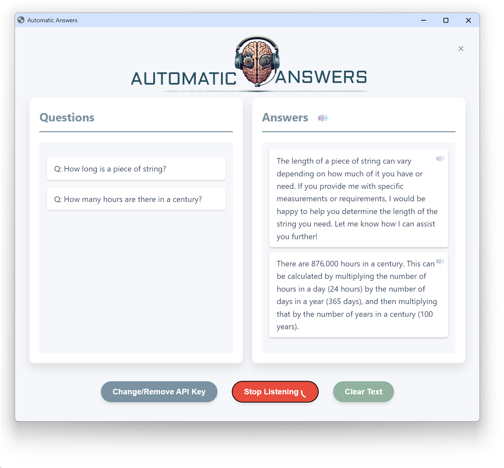

# AI Interview Assistant



AI Interview Assistant is an interactive application that uses speech recognition and AI-powered responses to simulate an interview experience. It listens to spoken questions, processes them using OpenAI's GPT model, and provides spoken and written responses.

## Features

- Speech recognition for capturing user questions
- AI-powered responses using OpenAI's GPT-3.5-turbo model
- Text-to-speech functionality for spoken answers
- User-friendly web interface
- API key management for OpenAI integration
- Mutable audio responses
- Responsive design for various screen sizes

## Prerequisites

Before you begin, ensure you have met the following requirements:

- Python 3.7+
- An OpenAI API key

## Installation

1. Clone the repository:
   ```
   git clone https://github.com/yourusername/ai-interview-assistant.git
   cd ai-interview-assistant
   ```

2. Install the required Python packages:
   ```
   pip install -r requirements.txt
   ```

3. Set up your OpenAI API key:
   - Run the application
   - Use the UI to enter your API key
   - The key will be saved for future use

## Usage

1. Run the main Python script:
   ```
   python inter_ass.py
   ```

2. The application will open in your default web browser.

3. If you haven't already, enter your OpenAI API key when prompted.

4. Click the "Start Listening" button to begin.

5. Ask your question clearly. The application will process your speech and display the question.

6. The AI will generate a response, which will be displayed in text and spoken aloud.

7. Use the mute icon next to each answer to toggle the audio on/off for that specific response.

8. Click the "Stop Listening" button when you're done.

## Configuration

- You can toggle text-to-speech on/off using the speaker icon next to the "Answers" heading.
- The "Clear Text" button will remove all questions and answers from the display.
- To change or remove your API key, use the "Change/Remove API Key" button.

## Troubleshooting

- If you encounter issues with speech recognition, ensure your microphone is properly connected and has the necessary permissions.
- If responses are slow, check your internet connection as the application requires online access for AI processing.

## Contributing

Contributions to the AI Interview Assistant are welcome. Please follow these steps:

1. Fork the repository.
2. Create a new branch: `git checkout -b <branch_name>`.
3. Make your changes and commit them: `git commit -m '<commit_message>'`
4. Push to the original branch: `git push origin <project_name>/<location>`
5. Create the pull request.

Alternatively, see the GitHub documentation on [creating a pull request](https://help.github.com/articles/creating-a-pull-request/).

## License

This project uses the following license: [MIT License](LICENSE.md).

## Contact

If you want to contact me, you can reach me at <your_email@example.com>.

## Acknowledgements

- [OpenAI](https://openai.com/) for providing the GPT and text-to-speech APIs
- [Eel](https://github.com/ChrisKnott/Eel) for the Python/JavaScript integration
- [SpeechRecognition](https://pypi.org/project/SpeechRecognition/) for the speech recognition functionality